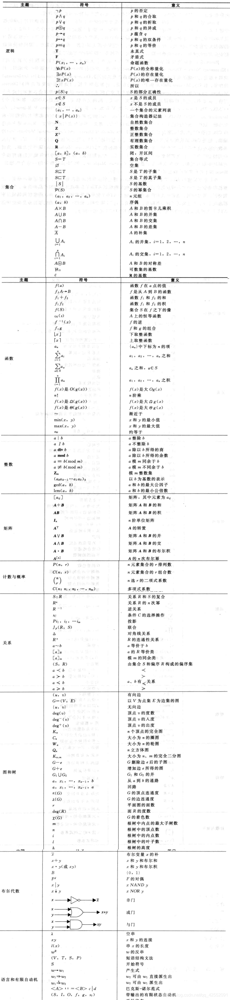
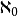
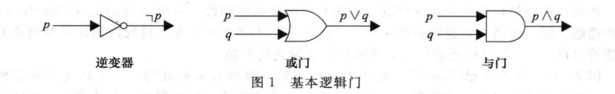
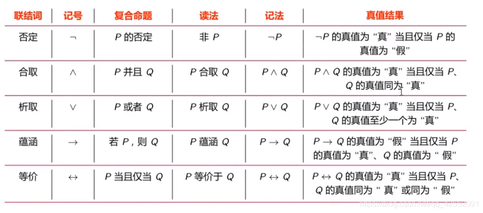

# 数学笔记

- [真值表](#真值表)
- [文氏图](#文氏图)
- [逻辑并且](#逻辑并且)
- [逻辑或](#逻辑或)
- [逻辑异或](#逻辑异或)
- [逻辑相等](#逻辑相等)
- [运算蕴含](#运算蕴含)
- [德摩根定律](#德摩根定律)
- [离散数学所有符号](#离散数学所有符号)

>- ### **量词**（∀ 全称量词 and存在量词 ∃  ）+ 变元 +谓词
>
>  - ∀*x* 表示“对于所有的 x”；
>  - ∃*y* 表示“存在某个 y”；
>  - ∀x*R*(x)：对于论域中的所有元素 *x*，都满足关系 *R*(*x*)。
>  - (∃*y*)*S*(*x*)：对于论域中的某个元素 *y*（这个 *y* 可能依赖于 *x*，也可能不依赖，但在此表达式中并未明确指出），存在关系 *S*(*x*,*y*)。
>
>- dom（定义域）
>
>- ran （值域），  `<1, 2>` ，其中的1 是dom定义域 ,  2就是 ran 值域， 
>
>  - `R = {<0,1>,<1,2>,<2,3>，  S= {<2,1>,<1,2>,<3,3>} ,可以转换成 ran`
>
>- 交集

- 能够判断对错的陈述句叫做  **命题(proposition)**
    - `小张的年龄在6岁以上` .这就是命题, 为真
    - 非 not ,标志为  Ā , 就是头上有一横 , 代表 不是A, 也就是说 A为 true, Ā 为false ,真值表

### 真值表

- **真值表没有遗漏和重复,兼顾了完整性和排他性.**

### 文氏图

### 逻辑并且

### 逻辑或

### 逻辑异或

### 逻辑相等

### 运算蕴含

- **蕴含基本上不做运算,只能做   若A则B   可以判断真假的命题**

- **A为false时,  无论B是什么, 都为 true**

## 德摩根定律

## 离散数学所有符号

### 集合

1. 设A,B两个集合有一种一一对应的关系ψ：A→B ， 则称A,B等势记做：A~B 。
   如果A=B ， 则A~B，反之不成立。
2. 凡与自然集合N等势的集合称之为可数集合 ， 该集合的基数记为（阿列夫零)
3. 开区间（0,1）称为不可数集合， 凡与开区间等势的集合称为不可数集合，称为阿列夫。

### 命题

1. 指派：在命题逻辑中，指派是指给每个命题变元（propositional variable）赋予一个真值（true 或 false）。
2. 对于含有 *n* 个命题变元的命题公式，每个命题变元都可以独立地取真值 true 或 false。因此，所有可能的指派数量是 2^n^。
   1. 含有3个命题变元的任一命题公式的指派格数是 (2^3^=8) 也就是8

3. 一切没有判断内容的句子都不能作为命题，命题应该是一个陈述语句
4. 设p为任意命题，非p称为p的否定式，记为﹁p。
5. p∧q 含义为 “p并且q”或“p与q” ； p∨q 含义为“p或q”，均为假才为假。
6. ∧∨⊕ 相当于 or ， and ，xor

p↔q 为 p与q 的等价式。q ， p相同才为真。

所有连接词的优先级为：否定，合取，析取 ， 蕴涵，等价。
\- 同级按从左到右

公式g为可满足公式， 如果它不是永假。那么g当且仅当至少有一个解释i ， 使g在 i 下为真。若g为永真 ， 则g一定为可满足公式，反之则不满足 。
\- 永假公式（矛盾式 ，永真公式为重言式）在它所有解释下其真值都为假，也可称为不可满足公式。

如果p↔q ,为永真式 ， 则充分必要条件是p 和q称为逻辑等价 ， p≡ q 。

结合律 ：g∨( h v s) = (g v h) v s 同 换成 ∧
- 分配律 ：
g ∨( h ∧ s ) = ( g∨ h ) ∧ (g ∨ s)
g ∧ ( h ∨ s ) = (g ∧ h )∨ (g ∧ s )
- 吸收律 ：
g ∨ ( g ∧ h ) = g
g ∧ ( g ∨ h ） = g
- 德摩根律 :
﹁ ( g ∨ h) = ﹁ g ∧ ﹁ h
﹁ ( g ∧ h) = ﹁ g ∨ ﹁ h
- 蕴含式 ：
g → h = ﹁ g∨ h
- 假言易位
g → h = ﹁ h → ﹁ g (逆否命题 )
- 等价式
g ↔ h = ( g → h ) ∧ ( h → g ） = （ ﹁ g ∨ h）∧ ( ﹁ h ∨ g)
- 等价否定式
g ↔ h =﹁ g ↔ ﹁ h
- 归谬论
（g → h ）∧ ( g → ﹁ h) = ﹁ g

永远赋值为真的式子为**重言式**

永远赋值为假的式子为**矛盾式**

至少有一个式子使其为真的时候为**可满足式**

文字：命题变项及其否定的总称

**简单析取式**：由有限个文字**析取**组成的

**简单合取式**：由有限个文字**合取**组成的

**析取范式**：有限个**合取**式**析取**而成

**合取范式**：有限个**析取**式**合取**而成

每个变元都出现一次的简单合取式都为**极小项**

每个变元都出现一次的简单析取式都为**极大项**

主析取范式：极小项的析取

主合取范式：极大项的合取 

**常用化极小项，极大项的方法**

对于含有2个命题变元的命题A，其主析取范式将包含所有可能的4个真值指派（因为每个命题变元有2种可能的真值，所以2个命题变元共有2^2^=4种真值指派）。
