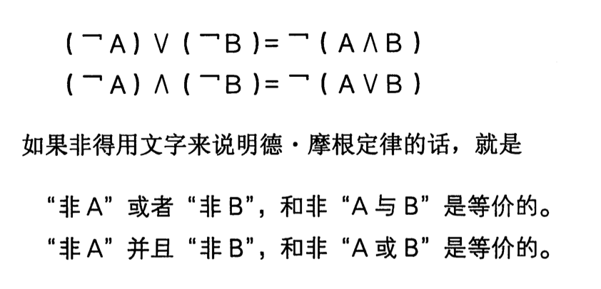

# 数学笔记

- [真值表](#真值表)
- [文氏图](#文氏图)
- [逻辑并且](#逻辑并且)
- [逻辑或](#逻辑或)
- [逻辑异或](#逻辑异或)
- [逻辑相等](#逻辑相等)
- [运算蕴含](#运算蕴含)
- [德摩根定律](#德摩根定律)
- 

- 能够判断对错的陈述句叫做  **命题(proposition)**
    - `小张的年龄在6岁以上` .这就是命题, 为真
    - 非 not ,标志为  Ā , 就是头上有一横 , 代表 不是A, 也就是说 A为 true, Ā 为false ,真值表

### 真值表

- **真值表没有遗漏和重复,兼顾了完整性和排他性.**

### 文氏图

### 逻辑并且

### 逻辑或

### 逻辑异或

### 逻辑相等

### 运算蕴含

- **蕴含基本上不做运算,只能做   若A则B   可以判断真假的命题**

- **A为false时,  无论B是什么, 都为 true**

## 德摩根定律

